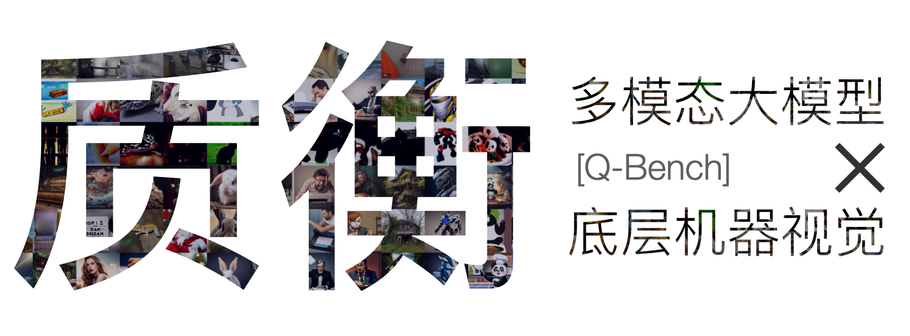

<div align="center">

  <h1>质衡: 通用基础模型在底层视觉上的基准测试 </h1>

_Q-Bench中文版，包含中文版【底层视觉问答】和【底层视觉描述】数据集，以及中文提示下的图片质量评价。_

  <div>
      <a href="https://teowu.github.io/" target="_blank">Haoning Wu</a><sup>1</sup><sup>*</sup>,
      <a href="https://github.com/zzc-1998" target="_blank">Zicheng Zhang</a><sup>2</sup><sup>*</sup>,
      <a href="https://github.com/ZhangErliCarl/" target="_blank">Erli Zhang</a><sup>1</sup><sup>*</sup>,
      <a href="https://chaofengc.github.io" target="_blank">Chaofeng Chen</a><sup>1</sup>,
      <a href="https://liaoliang92.github.io" target="_blank">Liang Liao</a><sup>1</sup>,
  </div>

<div>
      <a href="https://github.com/AnnanWangDaniel" target="_blank">Annan Wang</a><sup>1</sup>,
      <a href="https://github.com/lcysyzxdxc" target="_blank">Chunyi Li</a><sup>2</sup>,
      <a href="https://wenxiusun.com" target="_blank">Wenxiu Sun</a><sup>3</sup>,
      <a href="https://scholar.google.com/citations?user=uT9CtPYAAAAJ&hl=en" target="_blank">Qiong Yan</a><sup>3</sup>,
      <a href="https://ee.sjtu.edu.cn/en/FacultyDetail.aspx?id=24&infoid=153&flag=153" target="_blank">Guangtao Zhai</a><sup>2</sup>,
      <a href="https://personal.ntu.edu.sg/wslin/Home.html" target="_blank">Weisi Lin</a><sup>1</sup><sup>#</sup>
  </div>
  <div>
  <sup>1</sup>Nanyang Technological University, <sup>2</sup>Shanghai Jiaotong University, <sup>3</sup>Sensetime Research
       </div>   
<div>
<sup>*</sup>Equal contribution. <sup>#</sup>Corresponding author. 
   </div>

<a href="https://arxiv.org/abs/2309.14181"><strong>原始论文</strong></a> |
<a href="https://vqassessment.github.io/Q-Bench"><strong>网站</strong></a> |
     <a href="https://huggingface.co/datasets/nanyangtu/LLVisionQA-QBench"><strong>数据集 (LLVisionQA)</strong></a> |
 <a href="https://huggingface.co/datasets/nanyangtu/LLVisionQA-QBench"><strong>数据集 (LLDescribe)</strong></a> |
<a href="https://github.com/VQAssessment/Q-Bench"><strong>英文版Q-Bench Github Repo</strong></a>

  <div style="width: 80%; text-align: center; margin:auto;">
      
  </div>

</div>

**质衡** (Q-Bench) 是一个全新的基准，专门为测试多模态大模型在低层次机器视觉任务中的性能而设计。此基准集中于三个主要领域：感知（A1），描述（A2）和评估（A3）。这些领域分别对应于多模态大模型在理解和描述视觉信息方面的不同能力。

- 我们预计在本周释放中文版的图文数据集以及中文进行图像质量评价（IQA）的代码范例。
- 我们预计在两周内更新各种支持中文的大模型的表现。


## 联系

**质衡**由新加坡南洋理工大学和中国上海交通大学的研究者们开发。如有任何疑问，您可联系主要作者以获取相关信息：

- Haoning Wu, `haoning001@e.ntu.edu.sg`, @teowu
- Zicheng Zhang, `zzc1998@sjtu.edu.cn`, @zzc-1998
- Erli Zhang, `ezhang005@e.ntu.edu.sg`, @ZhangErliCarl

## 引用

如果需要引用本工作，敬请使用下述 bibtex 文本。

```bibtex
@article{wu2023qbench,
    title={Q-Bench: A Benchmark for General-Purpose Foundation Models on Low-level Vision},
    author={Wu, Haoning and Zhang, Zicheng and Zhang, Erli and Chen, Chaofeng and Liao, Liang and Wang, Annan and Li, Chunyi and Sun, Wenxiu and Yan, Qiong and Zhai, Guangtao and Lin, Weisi},
    year={2023},
}
```


