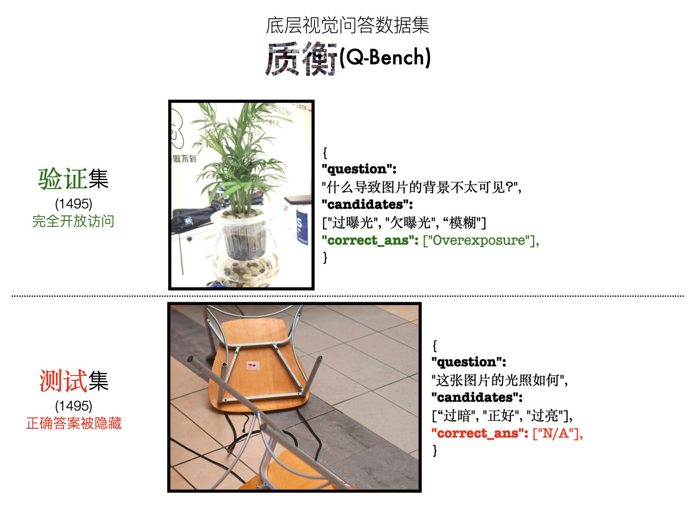

<div align="center">

  <h1>质衡: 通用基础模型在底层视觉上的基准测试 </h1>

_Q-Bench中文版，包含中文版【底层视觉问答】和【底层视觉描述】数据集，以及中文提示下的图片质量评价。_

  <div>
      <a href="https://teowu.github.io/" target="_blank">Haoning Wu</a><sup>1</sup><sup>*</sup>,
      <a href="https://github.com/zzc-1998" target="_blank">Zicheng Zhang</a><sup>2</sup><sup>*</sup>,
      <a href="https://github.com/ZhangErliCarl/" target="_blank">Erli Zhang</a><sup>1</sup><sup>*</sup>,
      <a href="https://chaofengc.github.io" target="_blank">Chaofeng Chen</a><sup>1</sup>,
      <a href="https://liaoliang92.github.io" target="_blank">Liang Liao</a><sup>1</sup>,
  </div>

<div>
      <a href="https://github.com/AnnanWangDaniel" target="_blank">Annan Wang</a><sup>1</sup>,
      <a href="https://github.com/lcysyzxdxc" target="_blank">Chunyi Li</a><sup>2</sup>,
      <a href="https://wenxiusun.com" target="_blank">Wenxiu Sun</a><sup>3</sup>,
      <a href="https://scholar.google.com/citations?user=uT9CtPYAAAAJ&hl=en" target="_blank">Qiong Yan</a><sup>3</sup>,
      <a href="https://ee.sjtu.edu.cn/en/FacultyDetail.aspx?id=24&infoid=153&flag=153" target="_blank">Guangtao Zhai</a><sup>2</sup>,
      <a href="https://personal.ntu.edu.sg/wslin/Home.html" target="_blank">Weisi Lin</a><sup>1</sup><sup>#</sup>
  </div>
  <div>
  <sup>1</sup>Nanyang Technological University, <sup>2</sup>Shanghai Jiaotong University, <sup>3</sup>Sensetime Research
       </div>   
<div>
<sup>*</sup>Equal contribution. <sup>#</sup>Corresponding author. 
   </div>

<a href="https://arxiv.org/abs/2309.14181"><strong>原始论文</strong></a> |
<a href="https://vqassessment.github.io/Q-Bench"><strong>网站</strong></a> |
     <a href="https://huggingface.co/datasets/nanyangtu/LLVisionQA-QBench"><strong>数据集 (LLVisionQA)</strong></a> |
 <a href="https://huggingface.co/datasets/nanyangtu/LLVisionQA-QBench"><strong>数据集 (LLDescribe)</strong></a> |
<a href="https://github.com/VQAssessment/Q-Bench"><strong>英文版Q-Bench Github Repo</strong></a>

  <div style="width: 80%; text-align: center; margin:auto;">
      
  </div>

</div>

**质衡** (Q-Bench) 是一个全新的基准，专门为测试**中文**多模态大模型在低层次机器视觉任务中的性能而设计。此基准集中于三个主要领域：感知（A1），描述（A2）和评估（A3）。这些领域分别对应于多模态大模型在理解和描述视觉信息方面的不同能力。


我们后续还将测试以下模型：
- [InternLM-XComposer]（测试中）
- [CogVLM] （待发布中文版）
- [MPlug-Owl-Multilingual] （待发布中文版）

## 数据

### A1: 感知（问答）
我们将数据集分成两半：验证集(dev)和测试集(test)，划分如下。




同英文版Q-Bench一致，图片发布在 huggingface 仓库的 [images.tar](https://huggingface.co/datasets/nanyangtu/LLVisionQA-QBench/resolve/main/images_llvisionqa.tar) 文件中。

验证集和测试集对应的中文标注地址如下：
- [验证集](https://huggingface.co/datasets/nanyangtu/LLVisionQA-QBench/resolve/main/%E8%B4%A8%E8%A1%A1-%E9%97%AE%E7%AD%94-%E9%AA%8C%E8%AF%81%E9%9B%86.json)
- [测试集](https://huggingface.co/datasets/nanyangtu/LLVisionQA-QBench/resolve/main/%E8%B4%A8%E8%A1%A1-%E9%97%AE%E7%AD%94-%E6%B5%8B%E8%AF%95%E9%9B%86.json)

### A2: 描述

描述任务需要的图片被发布在 [images.tar](https://huggingface.co/datasets/nanyangtu/LLVisionQA-QBench/resolve/main/images_lldescribe.tar) 文件中。

### A3: 评价

请参考[英文指南](https://github.com/VQAssessment/Q-Bench/tree/master/a3_iqa_databases)下载各个公开的图像质量评价数据集。

## 榜单

### A1: 感知（问答）

由于测试的模型同时支持英语，因此我们除了对比模型间的能力外，还对比模型的双语能力差距。总的来说，各模型的中文表现始终略逊英文表现。

- 验证集

|**模型** | yes-or-no | what | how | distortion | others | in-context distortion | in-context others | 总分 |
| - | - | - | - | - | - | -| - | -| 
| llava_v1.5 英文 | 0.6909 | 0.6327 | 0.5639 | 0.5525 | 0.6852 | 0.6086 | 0.7306 | 0.6314 |
| llava_v1.5 中文 | 0.6473 | 0.5796 | 0.5659 | 0.5175 | 0.6412 | 0.5954 | 0.7061 | 0.6000 (-0.0314) |
| qwen_vl 英文 | 0.6309 | 0.5819 | 0.5639 | 0.5058 | 0.6273 | 0.5789 | 0.7388 | 0.5940 |
| qwen_vl 中文| 0.6255 | 0.5774 | 0.5051 | 0.4942 | 0.5972 | 0.5658 | 0.6939 | 0.5712 (-0.0228) |
| visualglm 英文 | 0.6018 | 0.5420 | 0.4625 | 0.5175 | 0.5440 | 0.5362 | 0.5714 | 0.5378 |
| visualglm 中文 | 0.5509 | 0.4867 | 0.4300 | 0.4202 | 0.5139 | 0.4638 | 0.6367 | 0.4916 (-0.0462) |


- 测试集

|**模型** | yes-or-no | what | how | distortion | others | in-context distortion | in-context others | 总分 |
| - | - | - | - | - | - | -| - | -| 
| llava_v1.5 英文 | 0.6734 | 0.6334 | 0.5412 | 0.5278 | 0.6802 | 0.5856 | 0.7338 | 0.6181 |
| llava_v1.5 中文 | 0.6496 | 0.6009 | 0.5556 | 0.5298 | 0.6611 | 0.5788 | 0.6882 | 0.6040 (-0.0141) |
| qwen_vl 英文 | 0.6533 | 0.6074 | 0.5844 | 0.5413 | 0.6635 | 0.5822 | 0.7300 | 0.6167 |
| qwen_vl 中文 | 0.6113 | 0.5944 | 0.5350 | 0.4894 | 0.6253 | 0.5890 | 0.6844 | 0.5813 (-0.0354) |
| visualglm 英文 | 0.6131 | 0.5358 | 0.4403 | 0.4856 | 0.5489 | 0.5548 | 0.5779 | 0.5331 |
| visualglm 中文 | 0.5821 | 0.4512 | 0.4444 | 0.4472 | 0.5155 | 0.4829 | 0.5817 | 0.4970 (-0.0361) |


### A2: 描述

由于此项任务中GPT辅助测评具有很强的主观性，中文的描述任务分数和英文的描述任务分数难以直接进行比较。另外，目前在中文GPT辅助下的*准确性*评价指标的绝对分数还存在一些问题（相对分数的比例基本符合人的感知），因此目前版本的榜单仅供参考。

| **Model Name** | p_{0, 完整性} | p_{0, 完整性} | p_{2, 完整性} | s_{完整性} | p_{0, 准确性} | p_{0, 准确性} | p_{2, 准确性} | s_{准确性} | p_{0, 相关性} | p_{0, 相关性} | p_{2, 相关性} | s_{相关性} | s_{总分} | 
| - | - | - | - | - | - | - | - | - | - | - | - | - | - |
| llava_v1.5 | 4.61% | 52.53% | 42.86% | 1.38/2.00 |  67.95% | 26.84% | 5.20% | 0.37/2.00 |  0.65% | 23.36% | 75.99% | 1.75/2.00 |  3.51/6.00 |
| qwen_vl | 12.79% | 53.05% | 34.16% | 1.21/2.00 |  62.46% | 31.58% | 5.96% | 0.44/2.00 |  15.24% | 34.23% | 50.54% | 1.35/2.00 |  3.00/6.00 |
| visualglm | 6.48% | 52.58% | 40.94% | 1.34/2.00 |  76.80% | 19.76% | 3.44% | 0.27/2.00 |  0.49% | 31.52% | 67.98% | 1.67/2.00 |  3.29/6.00 |


### A3: 评价

由于中文语序/语法的原因，类似于英文Q-Bench的质量评价方案暂不适用中文。此外，由于该任务并没有显式的文本输出，我们暂时没有利用中文进行IQA的计划。

以下是英文Q-Bench进行IQA的方案：


欢迎社区贡献智慧提出针对性的中文IQA设计方案，由我们进行测试～

## 联系

**质衡**由新加坡南洋理工大学和中国上海交通大学的研究者们开发。如有任何疑问，您可联系主要作者以获取相关信息：

- Haoning Wu, `haoning001@e.ntu.edu.sg`, @teowu
- Zicheng Zhang, `zzc1998@sjtu.edu.cn`, @zzc-1998
- Erli Zhang, `ezhang005@e.ntu.edu.sg`, @ZhangErliCarl

## 引用

如果需要引用本工作，敬请使用下述 bibtex 文本。

```bibtex
@article{wu2023qbench,
    title={Q-Bench: A Benchmark for General-Purpose Foundation Models on Low-level Vision},
    author={Wu, Haoning and Zhang, Zicheng and Zhang, Erli and Chen, Chaofeng and Liao, Liang and Wang, Annan and Li, Chunyi and Sun, Wenxiu and Yan, Qiong and Zhai, Guangtao and Lin, Weisi},
    year={2023},
}
```


